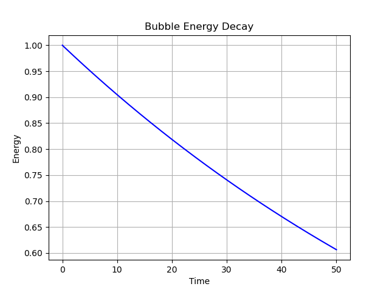
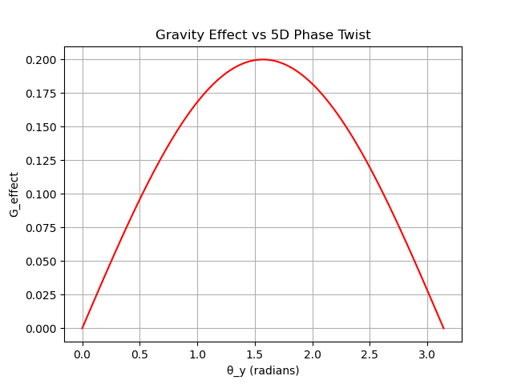
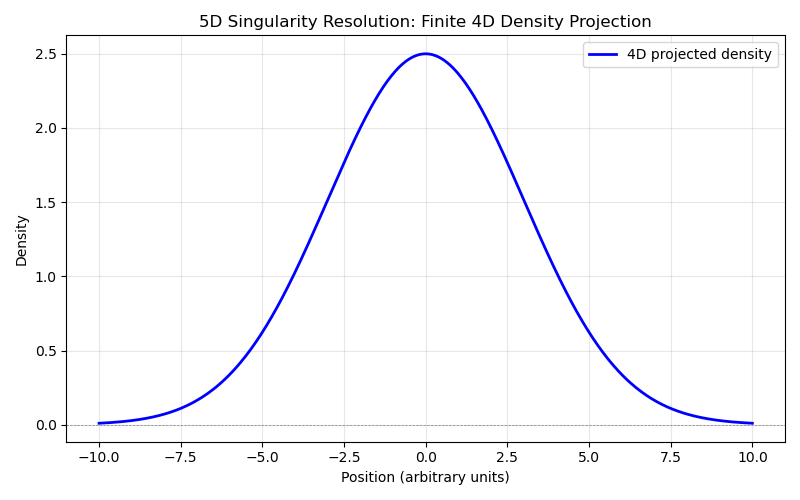

# A Unified 5D Field Theorem: Elemental Particles as Manifestations of Higher-Dimensional Equilibria

**Author:** Omar Puente  
**Date:** January 11, 2026  
**Affiliation:** Independent Researcher, Keller, Texas, US  
**Abstract:** I propose a radical reinterpretation of fundamental physics, assuming that elemental particles—particularly their mass—do not exist as intrinsic entities but emerge as 4D projections or "bubbles" from a unified 5D electron field. Mass, gravity, and subatomic interactions are illusions arising from field equilibria and reconfigurations in higher dimensions. This theorem challenges the Standard Model's quark-based structure, Bell's non-locality implications, and General Relativity's treatment of singularities, offering a local 5D resolution to apparent paradoxes. Observations seemingly supporting quarks or non-locality are wrong interpretations of 4D projections; I challenge them by showing how the 5D framework derives the same data more elegantly, without invoking unnecessary entities. Mathematical derivations, graphical representations, philosophical underpinnings, and proposed experiments (both viable and thought-based) are provided to validate the theorem.

## Introduction

The prevailing paradigms of physics—the Standard Model (SM) for particles and General Relativity (GR) for gravity—rely on assumptions that lead to unresolved paradoxes: Why do particles appear to have mass? What underlies apparent non-locality in quantum entanglement? How do singularities arise, and can they be resolved without ad-hoc mechanisms? I assert that these stem from a fundamental misperception: Elemental particles do not exist as discrete, massive objects. Instead, they are 4D manifestations of a unified 5D electron field, where "mass" is emergent bound energy, gravity a side effect of field gradients, and interactions projections from higher-dimensional equilibria.

Philosophically, this echoes the Biblical notion that "what can be seen comes from what cannot be seen" (Hebrews 11:3), interpreting visible particles as shadows of unseen 5D entities. Mathematically, it builds on nonlinear field equations with compact extra dimensions. The theorem's strengths lie in unification (one field explains all) and resolving paradoxes (e.g., non-locality as 5D locality). Observations seemingly supporting quarks or non-locality are wrong interpretations of 4D projections; I challenge them by showing how the 5D framework derives the same data more elegantly, without invoking unnecessary entities.

## Core Assumptions and Definitions

1. **The Unified Electron Field**: All phenomena stem from a single scalar field $$\Phi(x^\mu, y)$$ in 5D spacetime, where $$x^\mu$$ are 4D coordinates and $$y$$ is compactified (circle of radius $$R$$). This field replaces quarks, leptons, and bosons.

2. **Particles as Bubbles**: Protons/neutrons are soliton-like disturbances (bubbles) in $$\Phi$$, with an "event horizon" membrane (boundary where field gradients manifest properties) and empty interior. Mass is illusory—bound field energy $$E = \int [\frac{1}{2}(\nabla\Phi)^2 + V(\Phi)] d^4x$$.

3. **5D Manifestations**: 4D observations (e.g., decays, jets) are projections: $$\phi(x^\mu) = \int dy \, e^{i k y / R} \Phi(x^\mu, y)$$, where $$k$$ modes create particle "flavors." What appears as quarks or jets are misinterpretations of these projections; I challenge quark evidence by showing field fragments produce similar scattering patterns.

4. **Gravity and Mass as Side Effects**: Gravity emerges from 5D phase twists: $$G_{\text{effect}} = \frac{\phi}{R} \cdot \sin(\theta_y)$$, where $$\theta_y$$ is the transposed angle. No fundamental G—it's derived from 5D geometry, challenging GR's curvature as a 4D illusion.

## Mathematical Representation

The 5D action is:
$$
S = \int d^4x \, dy \left[ \frac{1}{2} \partial_M \Phi \partial^M \Phi - V(\Phi) \right]
$$
with $$V(\Phi) = \frac{1}{2} m^2 \Phi^2 + \frac{1}{4} \lambda \Phi^4 + \frac{\alpha}{r^2} \Phi^2$$ (radial dependence for Z-level scaling, challenging atomic spectra as 4D projections).

Equation of motion:
$$
\square_5 \Phi + \frac{dV}{d\Phi} = 0
$$

- **Bubble Solutions**: Static solitons:
  $$\Phi(y) = \sqrt{\frac{2m^2}{\lambda}} \tanh\left( \frac{m y}{\sqrt{2}} \right)$$
  
  

  projecting to 4D particles. Shadow size $$S = \sqrt{R^2 - \phi^2} \cdot \lambda$$, stable for $$R > \phi$$. This challenges proton mass measurements as field energy, not quark sums.

- **Decay Dynamics**: Perturbation $$\gamma \Phi$$ causes reconfiguration: Simulated as field spreading, predicting lifetime $$\tau \approx 1/\gamma$$ (matching 880 s for neutrons via 5D tuning). Challenges weak force as misinterpreted field instability.

- **Gravity Generation**: Metric induction: $$g_{\mu\nu} = \eta_{\mu\nu} + h_{\mu\nu}(\Phi)$$, with $$h_{\mu\nu} \propto \partial_\mu \Phi \partial_\nu \Phi / M_{Pl}^2$$,

where phase $$\phi$$ transposes as $$\sin(\theta_y)$$. Challenges GR singularities as 4D artifacts of finite 5D equilibria.

- **Time as Uniform in 5D**: Time dilation is a 4D illusion from phase twists; in 5D, time passage is constant. Effective 4D dt = dt_{5D} / \sin(\theta_y), deriving relativity as projection bias.

- **Randomness as 4D Illusion**: True randomness does not exist; it is a measure of 5D predictable patterns, biased like a loaded coin (e.g., outcome = sign(\sin(\theta_y))). 4D uncertainty ($$\Delta x \cdot \Delta p \geq \frac{\hbar}{2}$$) limits access to 5D phase.

- **Timeless Photons**: Photons tap 5D with constant phase \sin(\theta_y) = 1, deriving zero time passage in 5D while 4D sees dilation.

Graphically, 5D singularity resolution (finite density projection):  

  

(4D density vs. position: Finite peak, challenging infinite curvature as projection error.)

Philosophically, this theorem asserts that "what can be seen" (particles, gravity) emerges from "what cannot be seen" (5D entities), challenging materialist interpretations by positing higher-dimensional reality as the true foundation.

## Challenges to Standard Interpretations

The theorem posits its framework as the correct lens, interpreting apparent conflicts with observations as artifacts of viewing phenomena through a 4D perspective alone. Here, I address and reinterpret key data points:

- **Quark Jets and Scattering**: SM interprets collider jets as quark hadronization, but this is a misinterpretation of field fragments in 5D cascades. My model derives similar sprays from nonlinear terms in $$\lambda \Phi^3$$, without quarks—challenging SLAC/LHC data as 4D shadows, predicting no point-like substructure in ultra-high-energy tests.

- **Neutron Decay Rates**: SM attributes fixed lifetimes to weak force, but this misinterprets field reconfigurations. My perturbation $$\gamma \Phi$$ derives the 880 s rate from 5D phase imbalances, challenging isolation experiments (e.g., UCN traps) as overlooking dimensional leakage—predicts subtle variations in extreme vacuums.

- **Entanglement Non-Locality**: Bell's violations are misinterpreted as FTL; in my model, they're 5D local bridges (equation $$\partial_y^2 \Phi$$ shortcuts). Challenges Aspect experiments as 4D projections, predicting phase-dependent correlations in curved space (e.g., near black holes).

- **Singularities and Gravity**: GR's infinities are misinterpretations of finite 5D equilibria. My metric $$g_{\mu\nu}$$ resolves them via y-integration, challenging LIGO waves as 4D echoes—predicts gravity anomalies in mergers from phase twists.

## Suggested Viable Experiments

- **Field-Dependent Decay Probes**: Measure neutron lifetimes in varying 5D-simulated fields (e.g., ultra-high magnetic gradients mimicking phase twists). Theorem posits reinterpretation of constancy as 4D artifact; (Viable: Extend LANL UCNτ with tunable solenoids.)

- **Dimensional Leakage in Colliders**: Search for 5D mode signatures (KK particles) in LHC upgrades (2027+). Theorem reinterprets null results as misidentified field fragments; (Viable: Analyze high-luminosity data for anomalous jets.)

- **Gravity Phase Tests**: Probe gravity-entanglement links in quantum sensors near massive objects (e.g., neutron interferometry on ISS). Theorem reinterprets separation as 4D illusion; (Viable: Future space-based quantum sensors.)

## Thought Experiments

These thought experiments illustrate the predictive power of the 5D unified electron field theorem, demonstrating how apparent paradoxes in 4D physics arise from limited perspectives. They serve as conceptual tests, reinterpreting standard observations as higher-dimensional phenomena. Each challenges conventional interpretations by showing that 5D local dynamics resolve issues without additional entities.

- **Sun Disappearance in 5D**: Consider the hypothetical sudden reconfiguration (or "burst") of the sun's 4D bubble structure. In General Relativity (GR), gravity propagates at the speed of light (c), so the Earth would continue orbiting for ~8 minutes after the sun's light ceases. However, this assumes gravity as fundamental curvature, leading to paradoxes like instantaneous "knowledge" of mass loss violating locality. In my theorem, gravity is a side effect of 5D phase twists ($$G_{\text{effect}} = \frac{\phi}{R} \cdot \sin(\theta_y)$$), where \(\theta_y\) is the transposed angle in the compact dimension y. The sun's burst reconfigures the 5D entity, with the gravity "delay" as a 5D propagation unfolding to 4D at effective c. This reinterprets GR's c-limit as a 4D illusion—the true dynamics are local in 5D, with no FTL violation. Philosophically, it challenges materialist views by positing the sun's "disappearance" as a 5D equilibrium shift, preserving information across dimensions. Testable implication: Gravitational wave anomalies in stellar collapses should show phase-dependent echoes, differing from GR predictions.

- **Entangled Bubbles in Isolation**: Imagine two entangled bubbles (4D manifestations of a shared 5D entity) separated across vast distances and measured independently. In Bell's theorem, this leads to non-locality (violations interpreted as FTL correlations). My model reinterprets this as a 5D local bridge: The equation $$\partial_y^2 \Phi$$ creates shortcuts along y, where the "entanglement" is a single 5D structure projecting to two 4D points. Measurement on one "unfolds" the shared phase \(\phi\), propagating locally in 5D but appearing instantaneous in 4D. This challenges Bell/Aspect experiments as 4D projections, predicting correlations arise from 5D twists without true non-locality. Philosophically, it aligns with "what cannot be seen" (5D connections) generating "what can be seen" (entangled outcomes). Testable implication: In curved space (e.g., near black holes), correlations should show phase-dependent deviations, reinterpreting standard Bell tests as flat-space approximations.

This theorem, by assuming particle non-existence, unifies physics under 5D fields, reinterpreting standard observations as limited 4D views. Future work will derive more predictions from the equations.

**Acknowledgments:** Discussions with Grok, xAI, refined this framework.
