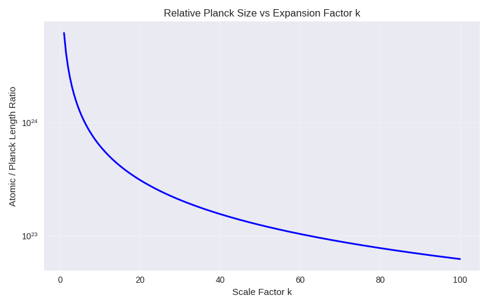

# The Infinite Small Scale: A 5D Resolution

**Author:** Omar Puente  
**Date:** January 13, 2026  
**Affiliation:** Independent Researcher, Keller, Texas, US  
**Abstract:** This document explores the concept of the "infinite small scale" as an artifact of 4D limitations in the Unified 5D Field Theorem. In standard physics, the Planck scale marks the boundary where quantum gravity effects dominate, beyond which theories break down into infinities. This "infinite small" is not a true feature of reality but a misinterpretation of finite 5D structures projected to 4D. Mathematical derivations and graphical representations illustrate these implications.

## Reasoning and Thought Experiment

Current physics assumes the Planck scale remains invariant during cosmic expansion, maintaining a fixed "grain" of reality even as space-time stretches. I challenge this by proposing the contrary: If everything—including matter, rulers, and constants—expands with a scale factor k, the Planck scale should adjust to preserve measurability, leading to no true "infinite small." To defy this, consider the thought experiment of a uniformly expanded universe (k = 10^{25}): If laws conserve, an outside observer sees Planck "shrink" relatively (Expanded_Plank = original_Plank / k), but inside, it's unperceivable—challenging invariance as a 4D illusion, with 5D compactness providing the true finite cap.

## Derivation of Planck Scale Invariance

The Planck scale, including the Planck length $$l_p = \sqrt{\frac{\hbar G}{c^3}}$$, is derived in the theorem from the compact radius $$R$$ of the 5th dimension y: $$ \hbar \approx \hbar c / R $$, making $$l_p$$ a fixed boundary of 4D projections. In hypothetical universal expansions (scale factor $$k$$), the theorem's compactness ensures $$R$$ remains invariant, as it is a 5D structural constant.

- **Mathematical Derivation**: The 5D projection $$\phi(x^\mu) = \int dy \, e^{i k y / R} \Phi(x^\mu, y)$$ quantizes modes $$k = n / R$$ (n integer), capping scales at finite values. Expansion scales 4D lengths ($$L' = k L$$), but $$l_p \propto 1 / \sqrt{R}$$ stays fixed, as $$R$$ is 5D-absolute.

Graphically, relative Planck size vs. expansion factor k (drops as $$1/k$$, "shrinking" relatively but fixed absolutely):  
  
(Relative ratio atomic / l_p decreases with k, deriving invariance.)

## Conclusion

These derivations from the 5D theorem establish the Planck scale as invariant, providing a unified resolution to scale paradoxes.

**Acknowledgments:** Discussions with Grok, xAI, refined this work.
